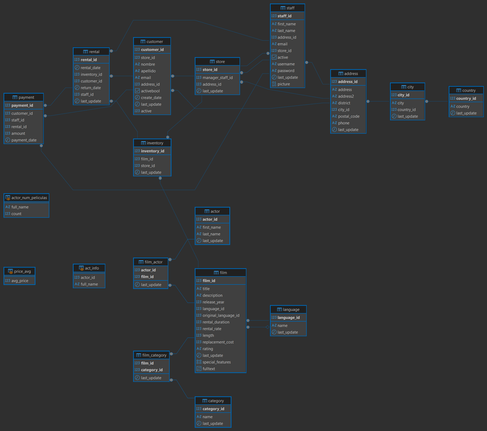

# Consultas SQL - Parte 1

## 1. Crea el esquema de la BBDD.


## 2. Muestra los nombres de todas las películas con una clasificación por edades de 'R' SQL
```
SELECT title, rating 
FROM film
WHERE rating IN ('R');
```
## 3 Encuenta los nombres de los catores que tengan un "actor_id" entre 30 y 40
```
select actor_id , first_name   
from actor
where actor_id  between 30 and 40;
```
## 4. Obtén las películas cuyo idioma coincide con el idioma original
En este caso el campo original_language_id es todo NULL y por eso no devuelve registros.
```
select *
from film
where language_id = original_language_id 
```
## 5. Ordena las películas por duración de forma ascendente.
```
select *
from film
order by length asc
```
## 6. Encuentra el nombre y apellido de los actores que tengan ‘Allen’ en su
apellido.
```
select concat(first_name,' ',last_name) as "Nombre Completo" 
from actor
where lower(last_name) in ('allen')
```
## 7. Encuentra la cantidad total de películas en cada clasificación de la tabla
“film” y muestra la clasificación junto con el recuento.
```
select rating, count(film_id) 
from film
group by rating
```
## 8. Encuentra el título de todas las películas que son ‘PG-13’ o tienen una
duración mayor a 3 horas en la tabla film.
```
select title 
from film
where rating = 'PG-13' or length > 180
```
## 9. Encuentra la variabilidad de lo que costaría reemplazar las películas.
```
select avg(replacement_cost) as "Promedio de Reemplazo" 
from film 
```
## 10. Encuentra la mayor y menor duración de una película de nuestra BBDD.
```
select MAX(length) as "Mayor Duración",
	MIN(length) as "Menor Duración"
from film 
```
## 11. Encuentra lo que costó el antepenúltimo alquiler ordenado por día.
```
select * 
from rental 
where rental_id = 
(select max(rental_id)-2 as Id 
from rental) 
order by rental_date 
```
## 12. Encuentra el título de las películas en la tabla “film” que no sean ni ‘NC17’ ni ‘G’ en cuanto a su clasificación.
```
select title 
from film
where rating not in  ('NC-17', 'G')
```
## 13. Encuentra el promedio de duración de las películas para cada clasificación de la tabla film y muestra la clasificación junto con elpromedio de duración.
```
select rating as Rating, round(AVG(length),2) as AVG_Length 
from  film
group by rating 
```
## 14. Encuentra el título de todas las películas que tengan una duración mayor a 180 minutos.
```
select title
from film
where length > 180
```
## 15. ¿Cuánto dinero ha generado en total la empresa?
```
select SUM(amount)
from payment
```
## 16. Muestra los 10 clientes con mayor valor de id.
```
select *
from customer
order by customer_id desc
limit 10
```
## 17. Encuentra el nombre y apellido de los actores que aparecen en la película con título ‘Egg Igby’.
```
select *
from film as f
join film_actor as fa on f.film_id = fa.film_id  
join actor as a on fa.actor_id = a.actor_id 
where LOWER(f.title) like 'egg igby' 
```
## 18. Selecciona todos los nombres de las películas únicos.
```
select distinct title
from film
```
## 19. Encuentra el título de las películas que son comedias y tienen una duración mayor a 180 minutos en la tabla “film”.
```
select f.title
from film f
join film_category fc on f.film_id = fc.film_id 
join category c on fc.category_id = c.category_id 
where c."name" = 'Comedy' and f.length > 180
```
## 20. Encuentra las categorías de películas que tienen un promedio de duración superior a 110 minutos y muestra el nombre de la categoría
junto con el promedio de duración.
```
select c."name", round(AVG(f.length),2) as total_min_categoria
from film f
join film_category fc on f.film_id = fc.film_id 
join category c on fc.category_id = c.category_id 
group by c."name" 
having AVG(f.length) > 110
```
## 21. ¿Cuál es la media de duración del alquiler de las películas?
```
select AVG(rental_duration) 
from film
```
## 22. Crea una columna con el nombre y apellidos de todos los actores y actrices.
```
create view act_info as 
	select concat(first_name, ' ', last_name) as full_name
	from actor a 
	
select * from act_info
```
## 23. Números de alquiler por día, ordenados por cantidad de alquiler de forma descendente.
```
select 
date(r.rental_date) as dia,
p.amount as cantidad, 
sum(r.rental_id) as alquileres_dia
from rental r
join payment p on r.rental_id = p.rental_id
group by date(r.rental_date), p.amount 
order by p.amount desc
```
## 24. Encuentra las películas con una duración superior al promedio.
```
select * 
from film
where (select AVG(length) from film) < length
```
## 25. Averigua el número de alquileres registrados por mes.
```
select 
concat(extract(month from r.rental_date),'-',extract(year from r.rental_date)) as mes,
sum(r.rental_id) as alquileres_mes
from rental r
join payment p on r.rental_id = p.rental_id
group by extract(month from r.rental_date), mes
order by mes asc
```
## 26. Encuentra el promedio, la desviación estándar y varianza del total pagado.
```
select AVG(amount) as promedio, 
stddev(amount) as desviacion_est, 
variance(amount) as varianza
from payment
```
## 27. ¿Qué películas se alquilan por encima del precio medio?
```
create view price_avg as 
	select AVG(amount) as avg_price
	from payment p 

select * 
from film f
join inventory i on f.film_id = i.film_id 
join rental r on i.inventory_id = r.inventory_id 
join payment p on r.rental_id = p.rental_id 
where (select avg_price from price_avg) < p.amount 
```
## 28. Muestra el id de los actores que hayan participado en más de 40 películas.
```
select a.actor_id
from actor a
join film_actor fa on a.actor_id = fa.actor_id  
join film f on fa.film_id = f.film_id 
group by a.actor_id 
having count(f.film_id) > 40
```
## 29. Obtener todas las películas y, si están disponibles en el inventario, mostrar la cantidad disponible.
```
select distinct f.title, count(i.inventory_id) from film f 
left join inventory i on f.film_id = i.film_id 
group by i.film_id, f.title  
```
## 30. Obtener los actores y el número de películas en las que ha actuado.
```
select distinct fa.actor_id, count(fa.film_id) as cantidad_peliculas
from film f 
left join film_actor fa on f.film_id = fa.film_id 
group by fa.actor_id  
```
## 31. Obtener todas las películas y mostrar los actores que han actuado en ellas, incluso si algunas películas no tienen actores asociados.
```
select f.title, ai.full_name 
from film f
left join film_actor fa on f.film_id = fa.film_id
left join act_info ai on fa.actor_id = ai.actor_id
order by f.title;
```
## 32. Obtener todos los actores y mostrar las películas en las que han actuado, incluso si algunos actores no han actuado en ninguna película.
```
select f.title, ai.first_name  from actor ai
left join film_actor fa on ai.actor_id = fa.actor_id  
left join film f on fa.film_id = f.film_id 
order by ai.first_name 
```
## 33. Obtener todas las películas que tenemos y todos los registros de alquiler.
```
select * 
from film f
full join inventory i on f.film_id = i.film_id 
full join rental r on i.inventory_id = r.inventory_id 
```
## 34. Encuentra los 5 clientes que más dinero se hayan gastado con nosotros.
```
select concat(c.first_name, ' ', c.last_name) as nombre, SUM(p.amount) as cantidad 
from customer c 
join payment p on c.customer_id = p.customer_id 
group by nombre 
order by SUM(p.amount) desc
limit 5
```
## 35. Selecciona todos los actores cuyo primer nombre es 'Johnny'.
```
select * 
from actor a 
where a.first_name like 'JOHNNY'
```
## 36. Renombra la columna “first_name” como Nombre y “last_name” como Apellido.
```
alter table customer 
rename column first_name to nombre

alter table customer 
rename column last_name to apellido
```
## 37. Encuentra el ID del actor más bajo y más alto en la tabla actor.
```
select MAX(actor_id), MIN(actor_id) from actor 
```
## 38. Cuenta cuántos actores hay en la tabla “actor”.
```
select count(actor_id) from actor 
```
## 39. Selecciona todos los actores y ordénalos por apellido en orden ascendente.
```
select * from actor 
order by actor.last_name asc
```
## 40. Selecciona las primeras 5 películas de la tabla “film”.
```
select * from film
limit 5
```
## 41. Agrupa los actores por su nombre y cuenta cuántos actores tienen el mismo nombre. ¿Cuál es el nombre más repetido?
```
select first_name, count(first_name) as cantidad 
from actor
group by first_name 
order by cantidad desc
```
KENNETH	4
PENELOPE 4

## 42. Encuentra todos los alquileres y los nombres de los clientes que los realizaron.
```
select r.rental_id, c.nombre
from rental r 
join customer c on r.customer_id = c.customer_id 
```
## 43. Muestra todos los clientes y sus alquileres si existen, incluyendo aquellos que no tienen alquileres.
```
select r.rental_id, c.nombre
from rental r 
left join customer c on r.customer_id = c.customer_id 
```
## 44. Realiza un CROSS JOIN entre las tablas film y category. ¿Aporta valor esta consulta? ¿Por qué? Deja después de la consulta la contestación.
```
select f.title, c."name"  
from film f
cross join category c
```
No aporta valor en este caso ya que únicamente junta cada película con todas las categorías que hay en la tabla category, así con todas las películas. Lo que aportaría valor es mostrar las categorías a las que pertenece una o todas película.

## 45. Encuentra los actores que han participado en películas de la categoría 'Action'.
```
select  c."name" as categoria, ai.full_name 
from act_info ai 
join film_actor fa on ai.actor_id = fa.actor_id 
join film_category fc on fa.film_id = fc.film_id 
join category c on fc.category_id = c.category_id 
where c."name" = 'Action'
```
## 46. Encuentra todos los actores que no han participado en películas.
```
select ai.full_name, count(fa.film_id) 
from act_info ai 
left join film_actor fa on ai.actor_id = fa.actor_id 
group by ai.full_name 
having count(fa.film_id) = 0
```
La BBDD no tiene actores sin películas????

## 47. Selecciona el nombre de los actores y la cantidad de películas en las que han participado.
```
select ai.full_name, count(fa.film_id) 
from act_info ai 
left join film_actor fa on ai.actor_id = fa.actor_id 
group by ai.actor_id, ai.full_name 
```
## 48. Crea una vista llamada “actor_num_peliculas” que muestre los nombres de los actores y el número de películas en las que han participado.
```
create view actor_num_peliculas as
	select ai.full_name, count(fa.film_id) 
	from act_info ai 
	left join film_actor fa on ai.actor_id = fa.actor_id 
	group by ai.actor_id, ai.full_name 
```
## 49. Calcula el número total de alquileres realizados por cada cliente.
```
select c.email, sum(c.customer_id)
from customer c  
join rental r on c.customer_id = r.customer_id 
group by c.customer_id , c.email 
```
## 50. Calcula la duración total de las películas en la categoría 'Action'.
```
select sum(f.length)
from film f
join film_category fc on f.film_id = fc.film_id 
join category c on fc.category_id = c.category_id 
where c."name" = 'Action'
```
## 51. Crea una tabla temporal llamada “cliente_rentas_temporal” para almacenar el total de alquileres por cliente.
```
create temp table clientes_rentas_temporal as 
	select c.email, sum(c.customer_id)
	from customer c  
	join rental r on c.customer_id = r.customer_id 
	group by c.customer_id , c.email 
```
## 52. Crea una tabla temporal llamada “peliculas_alquiladas” que almacene las películas que han sido alquiladas al menos 10 veces.
```
create temp table peliculas_alquiladas as 
	select f.title ,sum(r.rental_id)
	from film f
	join inventory i on f.film_id = i.film_id 
	join rental r on i.inventory_id = r.inventory_id 
	group by f.film_id 
	having sum(r.rental_id) > 10
```
## 53. Encuentra el título de las películas que han sido alquiladas por el cliente con el nombre ‘Tammy Sanders’ y que aún no se han devuelto. Ordena los resultados alfabéticamente por título de película.
```
create temp table tammy_films as 
	select  f.film_id,
    f.title,
    f.description,
    f.release_year,
    f.length,
    c.customer_id,
    c.nombre,
    c.apellido,
    c.email
	from film f 
	join inventory i on f.film_id = i.film_id
	join rental r on i.inventory_id = r.inventory_id
	join customer c on r.customer_id = c.customer_id
	where lower(concat(c.nombre,' ',c.apellido)) = 'tammy sanders'
```
Después de revisar la tabla rental y no encontrar ningún tipo de campo que pudiese ayudarme a saber si aun no se habían devuelto opté por obviar este punto. La comparación de fechas con NOW() no es viable ya que hablamos de fechas del 2005 - 2006.
```
select * from tammy_films
order by title asc 
```
## 54. Encuentra los nombres de los actores que han actuado en al menos una película que pertenece a la categoría ‘Sci-Fi’. Ordena los resultados alfabéticamente por apellido.
```
create temp table sci_films as 
	select f.film_id,
    f.title,
    c.category_id,
    c."name"
	from film f 
	join film_category fc on f.film_id = fc.film_id
	join category c on fc.category_id = c.category_id
	where c."name" = 'Sci-Fi'
```
```
select a.first_name, a.last_name, sf.title, sf.name
from actor a
join film_actor fa on a.actor_id = fa.actor_id 
join sci_films sf on fa.film_id = sf.film_id
order by a.last_name asc
```
## 55. Encuentra el nombre y apellido de los actores que han actuado en películas que se alquilaron después de que la película ‘Spartacus Cheaper’ se alquilara por primera vez. Ordena los resultados alfabéticamente por apellido.
```
create temp table film_act as 
	select f.film_id, f.title, a.first_name, a.last_name
	from film f 
	join film_actor fa on f.film_id = fa.film_id
	join actor a on fa.actor_id = a.actor_id
```
### Fecha Máxima
```
select max(r.rental_date) from rental r
join inventory i on r.inventory_id = i.inventory_id 
where i.film_id = 824
```
```
select * 
from film_act fa
join inventory i on fa.film_id = i.film_id 
join rental r on i.inventory_id  = r.inventory_id 
where 
(select max(r.rental_date) from rental r
join inventory i on r.inventory_id = i.inventory_id 
where i.film_id = 824) < r.rental_date 
```
## 56. Encuentra el nombre y apellido de los actores que no han actuado en ninguna película de la categoría ‘Music’.
```
select *
from film_act fa
join film_category fc on fa.film_id = fc.film_id 
join category c on fc.category_id = c.category_id 
where c."name" not like 'Music'
```
## 57. Encuentra el título de todas las películas que fueron alquiladas por más de 8 días.
```
select * from film f
where f.rental_duration > 8
```
Soy consciente de que también se puede hacer sumando los días de alquiler por película con los campos de la tabla rental.

## 58. Encuentra el título de todas las películas que son de la misma categoría que ‘Animation’.
```
select f.title
from film f
join film_category fc on f.film_id = fc.film_id 
join category c on fc.category_id = c.category_id 
where c."name" = 'Animation'
```
## 59. Encuentra los nombres de las películas que tienen la misma duración que la película con el título ‘Dancing Fever’. Ordena los resultados alfabéticamente por título de película.
```
select f.title, f.length 
from film f
where (
	select f.length from film f
	where lower(f.title) = 'dancing fever'
) = f.length 
order by f.title asc
```
## 60. Encuentra los nombres de los clientes que han alquilado al menos 7 películas distintas. Ordena los resultados alfabéticamente por apellido.
```
select distinct c.nombre, c.apellido, count(r.rental_id)
from customer c 
join rental r on c.customer_id = r.customer_id 
group by c.customer_id, c.nombre 
having count(r.rental_id) > 8
order by c.apellido asc
```
## 61. Encuentra la cantidad total de películas alquiladas por categoría y muestra el nombre de la categoría junto con el recuento de alquileres.
```
create temp table film_rents as 
	select f.film_id, count(r.rental_id) 
	from film f 
	join inventory i on f.film_id = i.film_id 
	join rental r on i.inventory_id = r.inventory_id 
	group by f.film_id 
```
```
select c."name", sum(fr.count)
from film_rents fr
join film_category fc on fr.film_id = fc.film_id 
join category c on fc.category_id = c.category_id 
group by c."name"
```
## 62. Encuentra el número de películas por categoría estrenadas en 2006.
```
select c."name" ,count(f.film_id) 
from film f
join film_category fc on f.film_id = fc.film_id 
join category c on fc.category_id = c.category_id 
where f.release_year = 2006
group by c."name" 
```
## 63. Obtén todas las combinaciones posibles de trabajadores con las tiendas que tenemos.
```
select * from staff s 
cross join store
```
## 64. Encuentra la cantidad total de películas alquiladas por cada cliente y muestra el ID del cliente, su nombre y apellido junto con la cantidad de películas alquiladas.
```
select c.customer_id, c.nombre, c.apellido, count(r.rental_id)
from customer c 
join rental r on c.customer_id = r.customer_id 
group by c.customer_id, c.nombre, c.apellido  
```